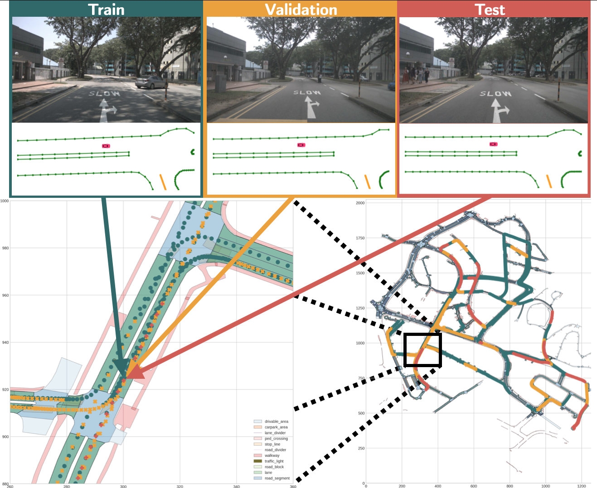
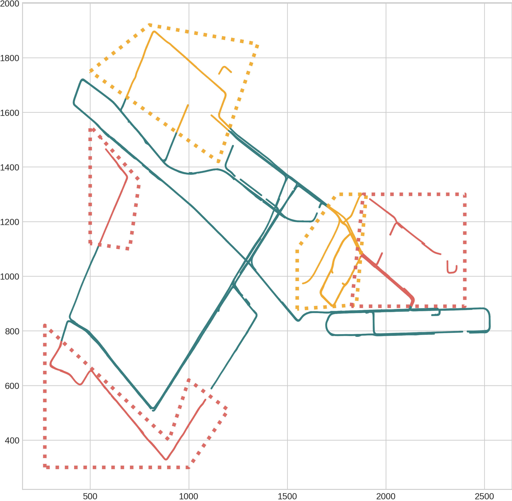
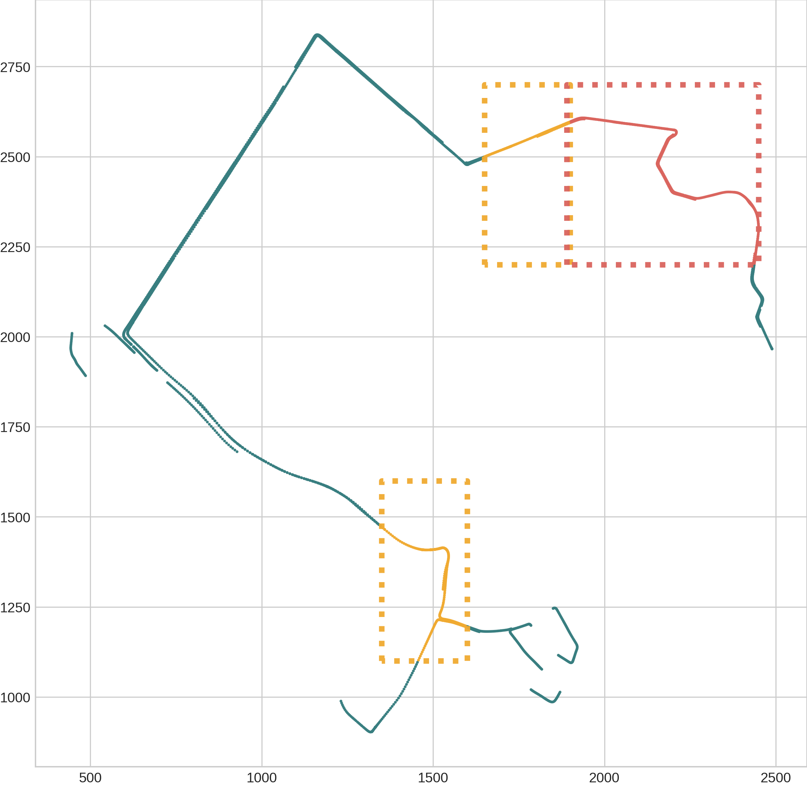
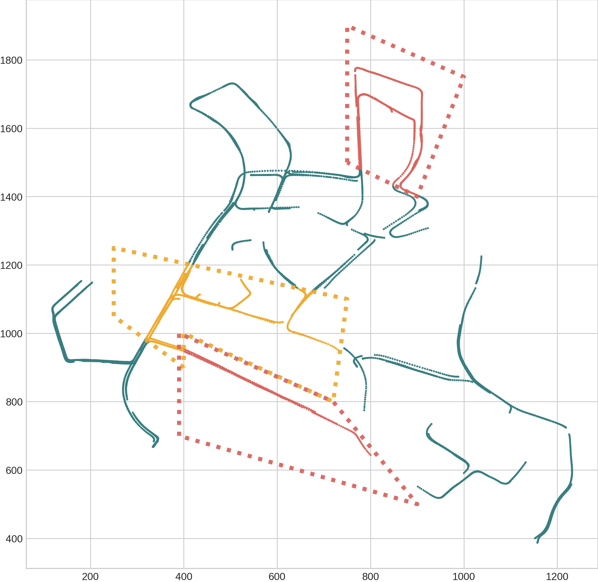
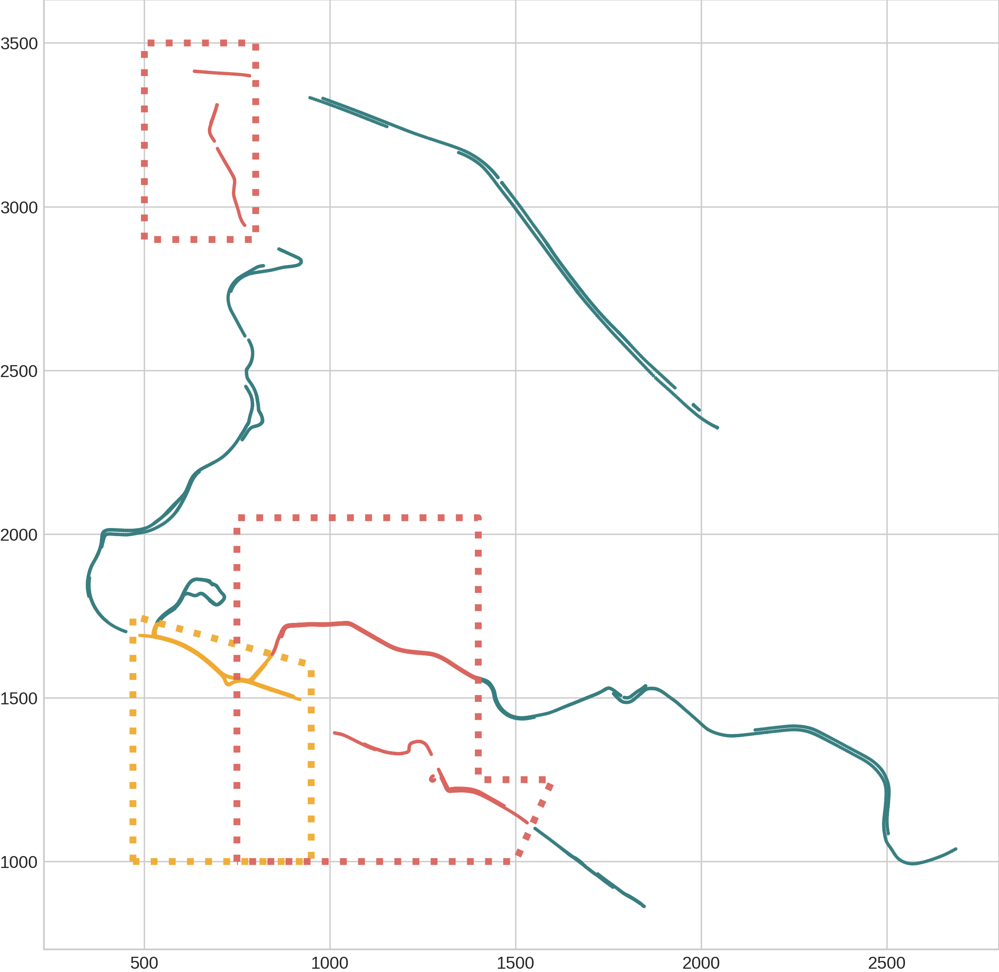
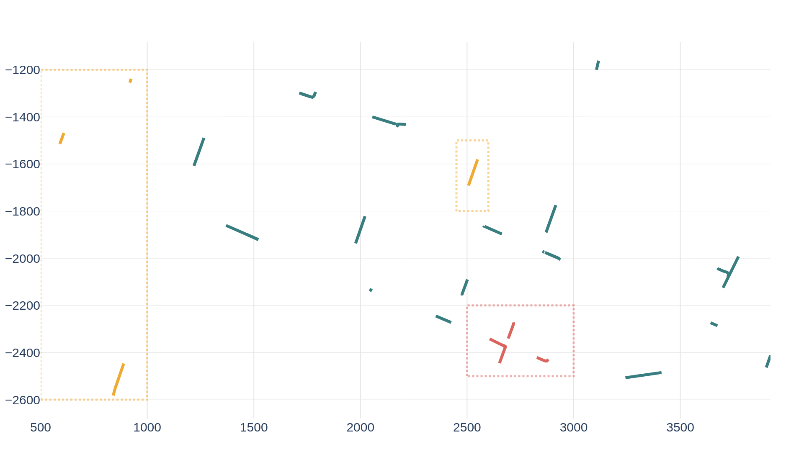
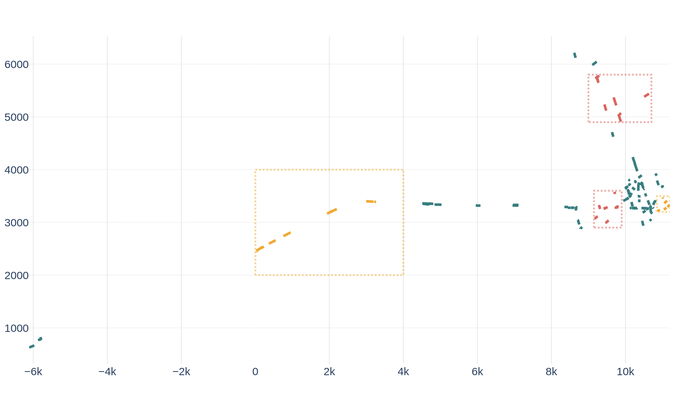
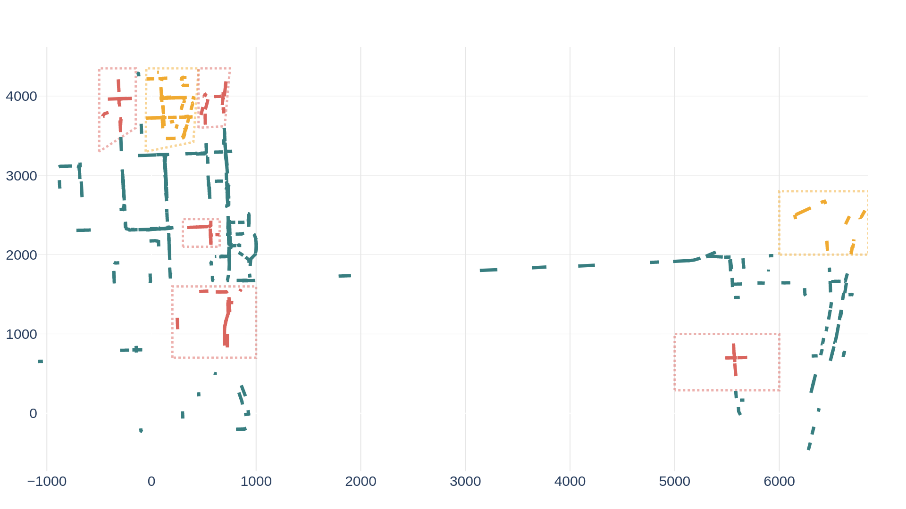
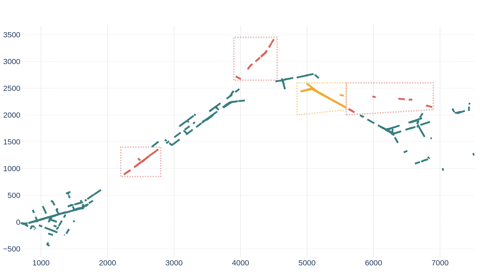
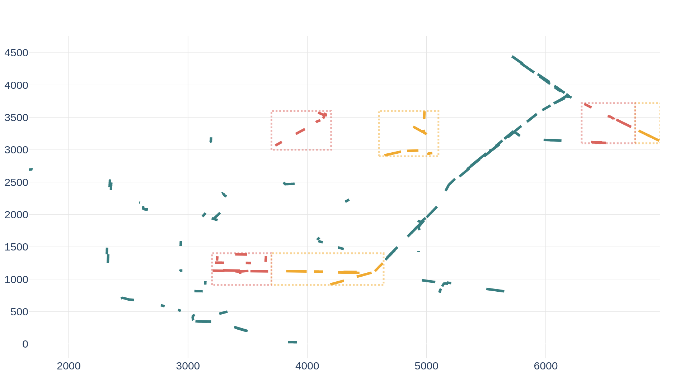

<div align="center"><h2>Localization Is All You Evaluate: Data Leakage in Online Mapping Datasets and How to Fix It</h2></div>
<p align="center">
    <!-- doc badges -->
    <a href="https://arxiv.org/abs/2312.06420">
        
    </a>
</p>

The state-of-the-art methods for online mapping are based on supervised learning and are trained predominantly using two datasets: nuScenes and Argoverse 2. These datasets revisit the same geographic locations across training, validation, and test sets which yields inflated performance numbers being reported. 

Specifically, over $80$\% of nuScenes and $40$\% of Argoverse 2 validation and test samples are located less than $5$ m from a training sample. The figure below displays an example of this, where three samples from the nuScenes dataset are highlighted. Despite being from different sets, the samples are situated in the same geographic location. 
<p align="center">
  
</p>

In our paper: Localization is All You Evaluate we propose to split the nuScenes and Arogverse 2 datasets by the samples' positions; Geographical splits. This repository contains the propsed geographical and citywise splits, and the code used to generate them. We also release some examples on how to convert the original pickle files to the geographical split pickle files for a set of online mapping methods.

# nuScenes Geographical Splits
<p align="center">
  
   
</p>
<p align="center">
  
  
</p>

# Argoverse 2 Geographical Splits
<p align="center">
  
   
</p>
<p align="center">
  
  
</p>
<p align="center">
  
   
</p>

# Usage
You can use the proposed splits to train and evaluate the performance of online mapping methods directly. 

The geographical and citywise splits are defined in txt files (also pkl-files exists for convinience) under `/citywise_splits` and `/geo_splits` respectively. 

For Geographical nuScenes splits there are two versions: 

1 - `geo_splits/nuscenes/samples`: where all samples are used and sequences that straddles a set boundary are split in two parts and assigned to the respective sets (see paper for details). The split-files consist of all indivudual samples' set assignment.

2 - `geo_splits/nuscenes/scenes`: sequences that straddles a set boundary are removed. The split-files contain the scene-name for each set assignment.

For Citywise splits the name of the file indicates the city and the set. E.g. `singapore.txt` contains the scenes from Singapore and `PIT+MIA.txt` contains the log ids for Pittsburgh and Miami.


# Create/Verify Geographical Splits and results in paper
If you want to verify the geographical splits, you can install the required packages and run the accompanying code as follows:

## Install

```
conda create --name geosplits python=3.8
conda activate geosplits
pip install -r requirements.txt
```

## Download data
Download according to the instructions in the respective repositories:
- nuScenes (https://www.nuscenes.org/download) 
- Argoverse 2 (https://www.argoverse.org/av2.html#download-link) 

## Generate Geographical Splits
Create nuScenes splits:
```
python src/nuscenes/generate_geo_split.py --data_dir /path/to/nuscenes 
```
Create Argoverse 2 splits:
```
python src/argoverse2/generate_geo_split.py --data_dir /path/to/argoverse2
```

## Generate original pkl files using the method of your choice
Generate the necessary dataset pkls following the instructions in the respective repositories:
- MapTR: https://github.com/hustvl/MapTR/tree/main
- MapTRv2: https://github.com/hustvl/MapTR/tree/maptrv2
- VectorMapNet & HDMapNet: https://github.com/Tsinghua-MARS-Lab/Online_Map_Construction_Benchmark
- More to be added...

## Convert pickle files from a method to geographical split pkls
Convert the dataset pkl files you generated in the previous step to geographical split pkls:
```
python src/nuscenes/convert_pkls.py --method my-selected-method --pkl_dir /path/to/pkls/folder/of/my/selected/method --output_dir /path/to/output 
```
```
python src/argoverse2/convert_pkls.py --method my-selected-method --pkl_dir /path/to/pkls/folder/of/my/selected/method --output_dir /path/to/output 
```
The '--og_pkl_name' argument can be used to specify the base name of the original pkl files. E.g. the default for nuscenes is 'nuscenes_map_infos_temporal' and then '_train', '_val', '_test' will be appended to the base name to find the original pkl files.

## Train & Evaluate
Follow the instructions in the respective repositories for training and evaluation. Simply replace the path to the original pkl files with the geographical split pkls you created above.